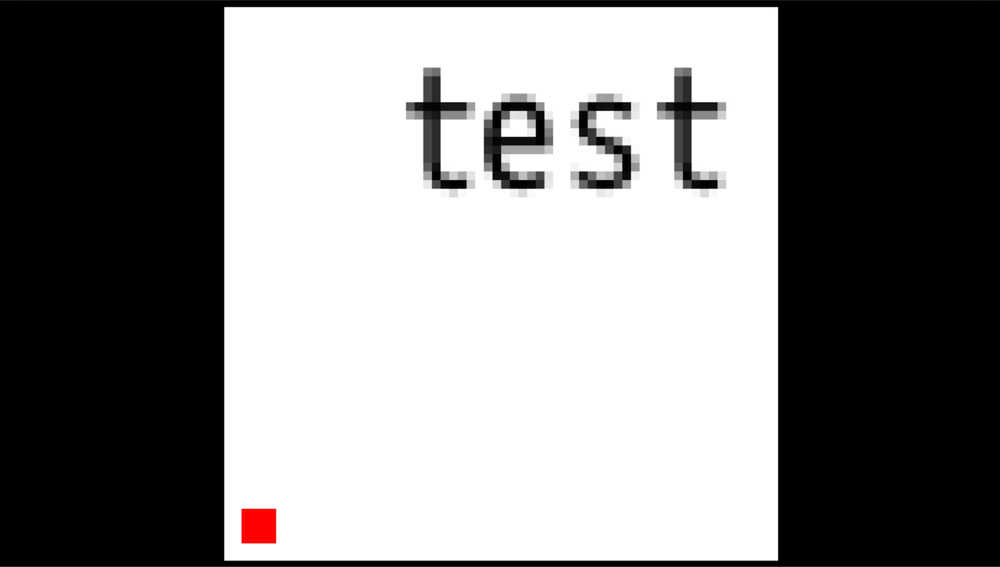
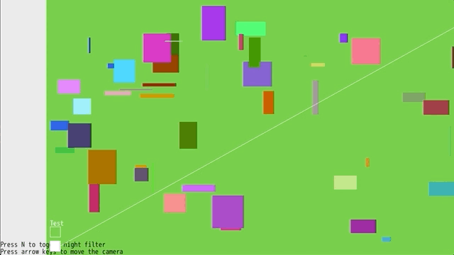
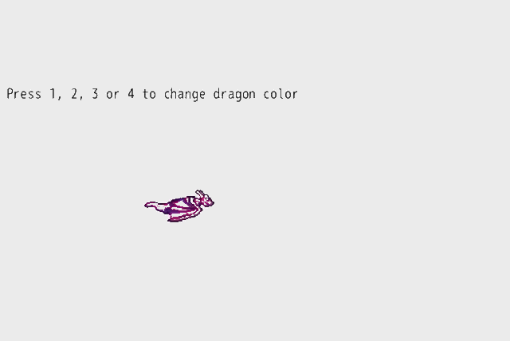

# DragonRuby Toolbox

Useful classes &amp; code snippets for DragonRuby GameToolkit

Start the demo with
```sh
./dragonruby dragonruby-toolbox
```

## [Low Resolution Canvas](./app/low_resolution.rb)



File to include: [`lib/low_resolution_canvas.rb`](./lib/low_resolution_canvas.rb)

```rb
def tick(args)
  # Specify your canvas resolution as the first constructor argument
  args.state.canvas ||= LowResolutionCanvas.new([64, 64])

  args.state.canvas.background_color = [255, 255, 255]
  args.state.canvas.labels << [20, 60, 'test']
  args.state.canvas.primitives << [2, 2, 4, 4, 255, 0, 0].solid
  # Render your game content to your LowResolutionCanvas like you would to args.outputs

  args.outputs.background_color = [0, 0, 0]
  # Be sure to add your LowResolutionCanvas to args.outputs.primitives or args.outputs.sprites to render it to the screen
  args.outputs.primitives << args.state.canvas
end
```

## [Transformations](./app/transformations.rb)



## [Color class with HSV/HSL support](./app/colors_hsv_hsl.rb)


## [Color accessor for attr_sprite enhanced classes](./app/color_accessor.rb)


