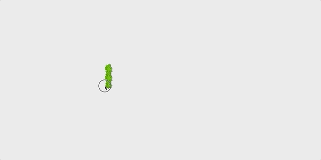
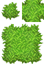
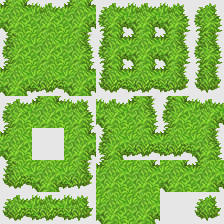

# DragonRuby Toolbox


#### Useful classes &amp; code snippets for DragonRuby GameToolkit


## Table of content

- [**Getting Started**](#getting-started)
- [Contents](#contents)
  - [Autotiles](#autotiles)
  - [Low Resolution Canvas](#low-resolution-canvas)
  - [Quaternions](#quaternions)
  - [Transformations](#transformations)
  - [Color class with HSV/HSL support](#color-class-with-hsvhsl-support)
  - [Color accessor for attr_sprite enhanced classes](#color-accessor-for-attr_sprite-enhanced-classes)
- [Get Help](#get-help)
- [Contributing](#contributing)
- [License](#license)


## Getting Started

Checkout the repository into your dragonruby folder and just start the demo with:

```sh
./dragonruby dragonruby-toolbox
```

All of the shared tools consist of one ruby file which you can copy in your game and require.


## Contents

### Autotiles



File to include: [`lib/autotile.rb`](./lib/autotile.rb)

1. Generate an autotile tileset from a source file like this:

   

   ```rb
   tileset_target = args.render_target(:grass_tileset)
   tileset_target.primitives << DRT::Autotile.generate_tileset_primitives('sprites/grass-autotile.png', 32)
   ```

   Above file will create a tileset like this

   

   You can skip this step and handcraft a tileset with above layout yourself.

2. Create a tile object using the tileset

   ```rb
   grass_tile = DRT::Autotile.new(:grass_tileset, 32)
   ```

3. Draw the correct tile by specifying which neighbor cells contain the same tile

   Method 1 (recommended): Create Autotile instances

   ```rb
   tile_instance = grass_tile.create_instance(x: 200, y: 200, neighbors: DRT::Autotile::Neighbors.new(:up, :right, :up_right))
   args.outputs.primitives << tile_instance
   ```

   Method 2: Render hash primitives
   ```rb
   rendered_tile = grass_tile.render DRT::Autotile::Neighbors.new(:up, :right, :up_right)
   rendered_tile[:x] = 200
   rendered_tile[:y] = 200

   args.outputs.primitives << rendered_tile
   ```

See the [example source code](./app/autotiles.rb) and [library code comments](./lib/autotile.rb) for more details.

### [Low Resolution Canvas](./app/low_resolution.rb)


File to include: [`lib/low_resolution_canvas.rb`](./lib/low_resolution_canvas.rb)

```rb
def tick(args)
  # Specify your canvas resolution as the first constructor argument
  args.state.canvas ||= LowResolutionCanvas.new([64, 64])

  args.state.canvas.background_color = [255, 255, 255]
  args.state.canvas.labels << [20, 60, 'test']
  args.state.canvas.primitives << [2, 2, 4, 4, 255, 0, 0].solid
  # Render your game content to your LowResolutionCanvas like you would to args.outputs

  args.outputs.background_color = [0, 0, 0]
  # Be sure to add your LowResolutionCanvas to args.outputs.primitives or args.outputs.sprites to render it to the screen
  args.outputs.primitives << args.state.canvas
end
```


### [Quaternions]

File to include: [`lib/quaternion.rb`](./lib/quaternion.rb)

(Example coming soon)


### [Transformations](./app/transformations.rb)


### [Color class with HSV/HSL support](./app/colors_hsv_hsl.rb)


### [Color accessor for attr_sprite enhanced classes](./app/color_accessor.rb)


## Get Help

I'm usually online in the [DragonRuby Discord server](http://discord.dragonruby.org/) as user **kfischer_okarin**. If you have any questions or suggestions join the server and ping me. :)


## Contributing

This repository is not intended to be a comprehensive framework of any kind, but is rather a collection of tools I made I thought might be useful to share with whoever might find them useful.

If you find any bug or have an idea how to improve the usability of the tools, feel free to open an issue. Even better, just join the DragonRuby Discord channel (see [Get Help](#get-help)) and discuss with me directly.


## License

This project is licensed under the [MIT License](LICENSE)
